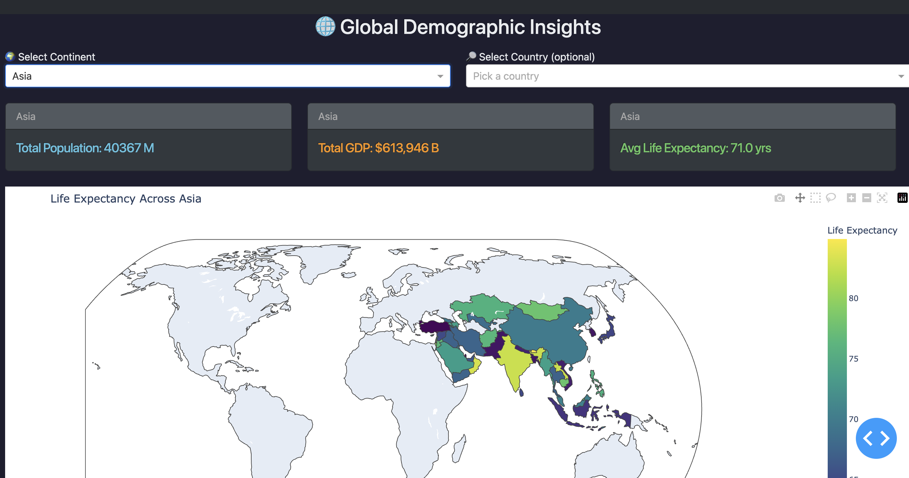

## 📊 Global Demographics Dashboard

An interactive web application built using **Dash**, **Plotly**, and **Docker** to explore global demographic data including **Population**, **GDP**, and **Life Expectancy** across countries and continents.

 

---

### 🚀 Features

* 🌍 **Interactive world map** showing life expectancy by country
* 🔎 **Continent-wise filtering** with aggregate statistics
* 📍 **Country-specific view** with zoomed-in map and detailed cards
* 📊 Bar charts for **Population** and **GDP**
* 🎨 Beautiful **dark theme** using Dash Bootstrap
* 🔁 Real-time UI updates using dropdowns
* 🐳 **Docker + Docker Compose** support for easy deployment

---

### 📁 Project Structure

```
├── app/
│   └── app.py                # Dash application code
├── Dockerfile                # Docker build configuration
├── docker-compose.yml        # For running app easily with Docker
└── README.md
```

---

### 🐳 Run Using Docker Compose

1. **Build and start the app**

```bash
docker-compose up --build
```

2. Open your browser and go to:
   👉 `http://localhost:8050`

---

### ⚙️ Live Code Updates

Thanks to Docker volume mounts, any change you make in `app/app.py` will **auto-reload in your browser** without restarting the container.

---

### 📦 Requirements (for manual run without Docker)

If you prefer not to use Docker:

```bash
pip install dash dash-bootstrap-components pandas plotly
python app/app.py
```

---

### 🧠 How It Works

* If a **country** is selected → show only **country stats & zoomed map**
* If a **continent** is selected → clear country selection and show **aggregate info**
* Layout auto-updates based on selection
* Powered by **Dash callbacks** for interactivity

---

### 📌 To Do / Ideas for Future

* 🌐 Add real-world latitude/longitude to zoom precisely on country
* 📥 Allow uploading custom CSV for analysis
* 🖼 Export dashboard as image or PDF
* 🎨 Theme toggle (light/dark)

---

### 👨‍💻 Author

Made with ❤️ by **Rahul Bhoyar**